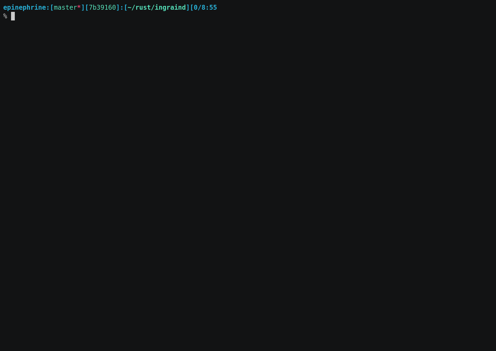

ingraind
========

Data-first monitoring.

ingraind is a security monitoring agent built around [RedBPF](https://github.com/redsift/redbpf)
for complex containerized environments and endpoints. The ingraind agent uses eBPF
probes to provide safe and performant instrumentation for any Linux-based environment.

InGrain provides oversight of assets and risks:
 * Your customer data - an employee copying your customer database to their
   personal cloud store.
 * Your infrastructure - an attacker executing a zero day attack to gain access
   to your web servers.
 * Your resources - malware using your users machines compute resources to mine
   cryptocurrency.
   
This is what `curl https://redsift.com` looks like if seen through ingraind:

## Requirements
 
 * LLVM/Clang
 * Rust toolchain [rustup.rs](https://rustup.rs)
 * [BCC](https://github.com/iovisor/bcc)
 * Linux 4.4 or newer + headers
 
## Compile

Compilation on Arch Linux will pick up the currently installed source tree using
`pacman`.

On other distributions, set the `KERNEL_SOURCE` environment variable with the
path to the kernel source tree.

Please note that this actually needs to be a **dirty** source tree of an actual
kernel, not just a version compatible bare source tree.

The usual Rust compilation ritual will produce a binary in `target/release`:

    cargo build --release
    
or with custom sources:

    env KERNEL_SOURCE=/usr/src/kernel/$(uname -r) cargo build --release
    
To build a Docker container, make sure `kernel` directory is populated with the
source tree of the target kernel.

The resulting container is tagged `ingraind` by default, but you can set
additional tags or pass `docker` flags like so:

    docker/build.sh -t ingraind:$(git rev-parse HEAD | cut -c-7)
    
## Configuration & Run

To get an idea about the configuration [file
structure](https://github.com/redsift/ingraind/wiki/Configuration), consult the
wiki or take a look at the [example config](./config.toml.example) for a full reference.

To start `ingraind`, run:

    ./target/release/ingraind config.toml
    
Depending on the backends used in the config file, some secrets may need to be
passed as environment variables. These are documented in
[config.toml.example](./config.toml.example), which should be a good starting point,
and a sane default to get `ingraind` running, printing everything to the standard output.
 
## Repo structure

The `bpf` directory contains the BPF modules. These are compiled by `build.rs`,
and embedded in the final binary, and will be managed by the grains.

# Anything else?

For more information, look at the [Wiki](https://github.com/redsift/ingraind/wiki)
